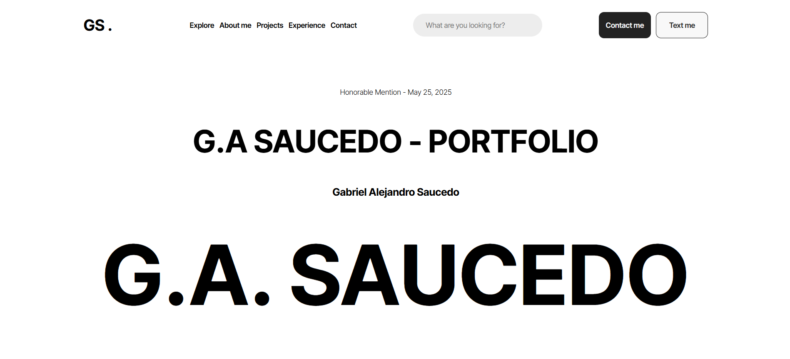
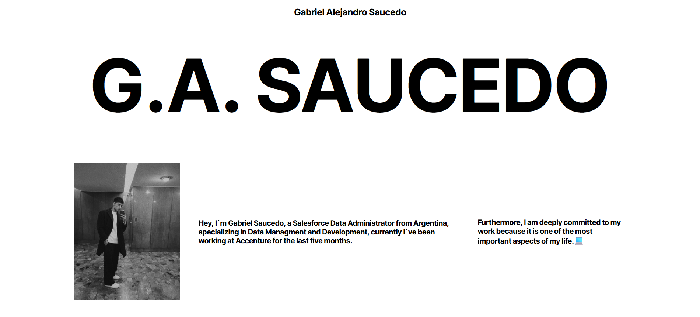
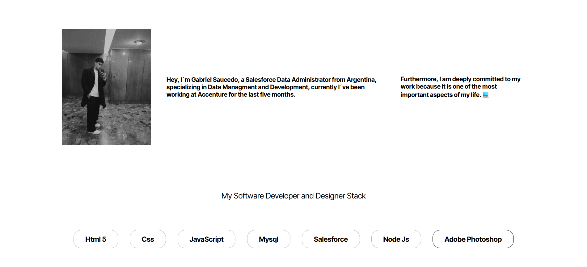
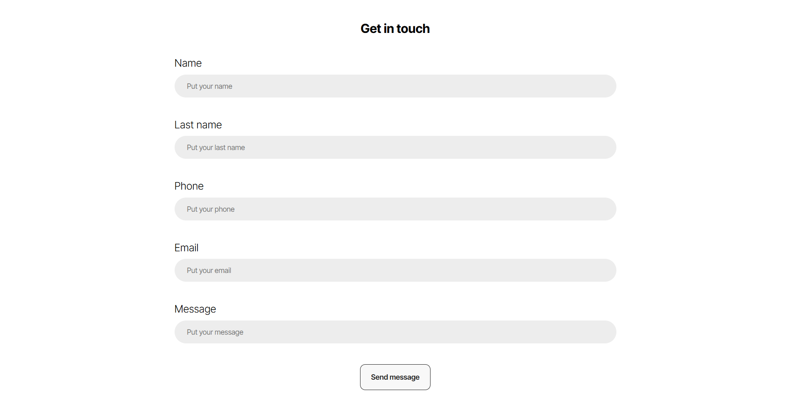

# new-portfolio
# 🧑‍💻 G.A. Saucedo – Portfolio

This repository contains the source code and assets for my personal developer portfolio website. It's a showcase of my experience, my development stack, and professional journey, designed to reflect both my technical skills and personal brand.

## 📚 Overview

This portfolio is a clean, minimalist, and responsive web application built to highlight:

- My background and experience as a full stack developer and Salesforce Data Administrator.
- Contact options for potential employers, collaborators, or clients.

## 🚀 Live Demo

[🔗 Visit My Portfolio](To be attached...)

## 🔧 Tech Stack

- **Frontend:** HTML5, CSS3, JavaScript
- **Styling:**  BEM & CSS
- **Deployment:** GitHub Pages

## 📁 Features

- 📱 Mobile-first design
- 🧩 BEM architecture
- 🧠 SEO-friendly and performance optimized

## 📷 Screenshots

You can find high-fidelity images and diagrams in the `/images` folder:

